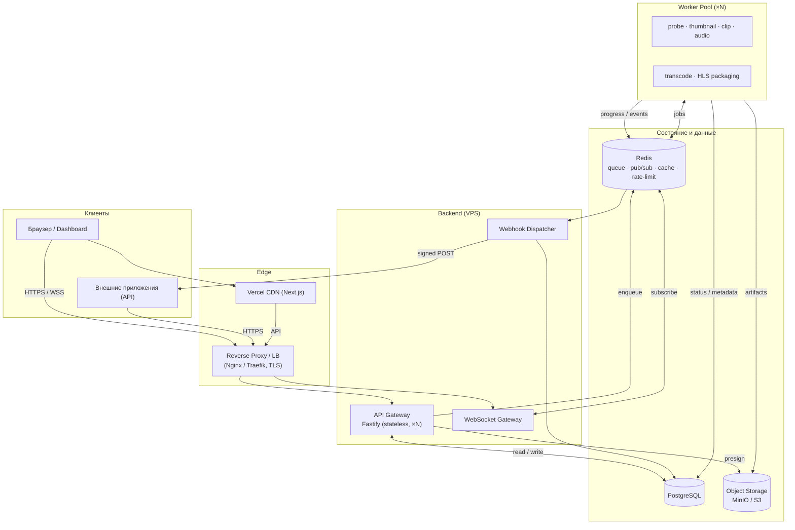
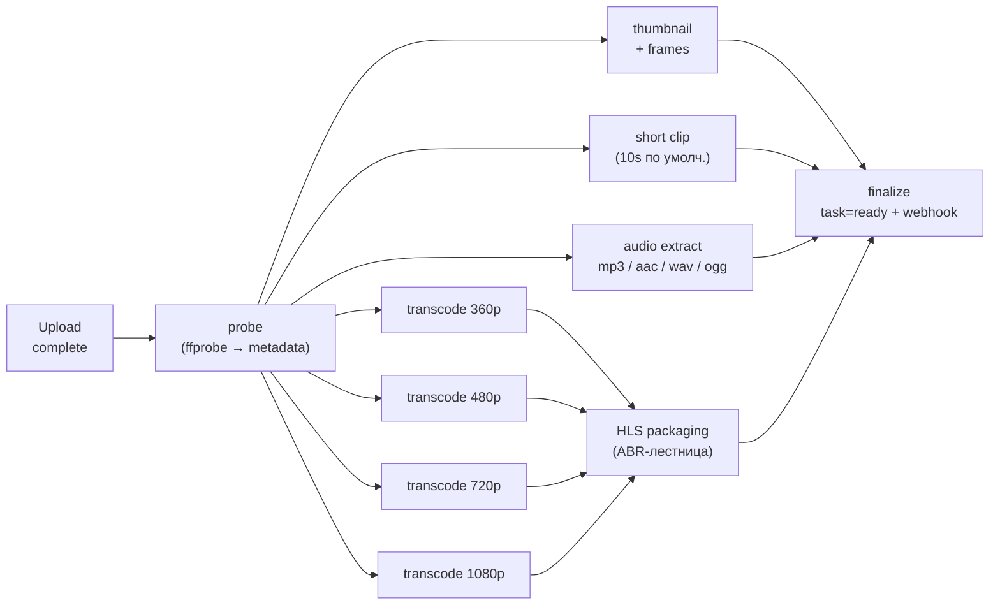
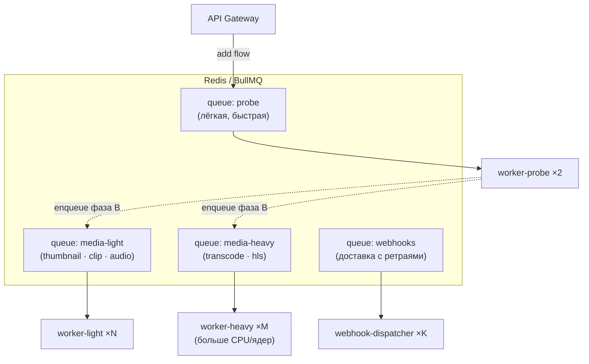
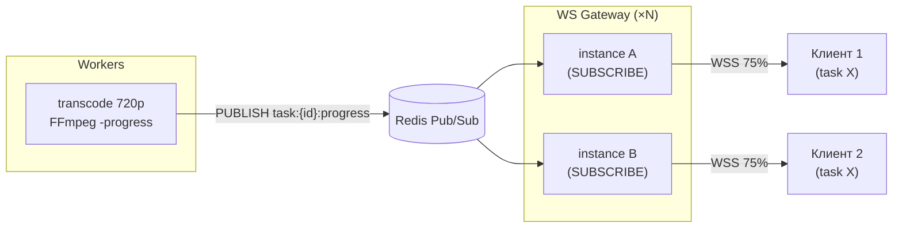
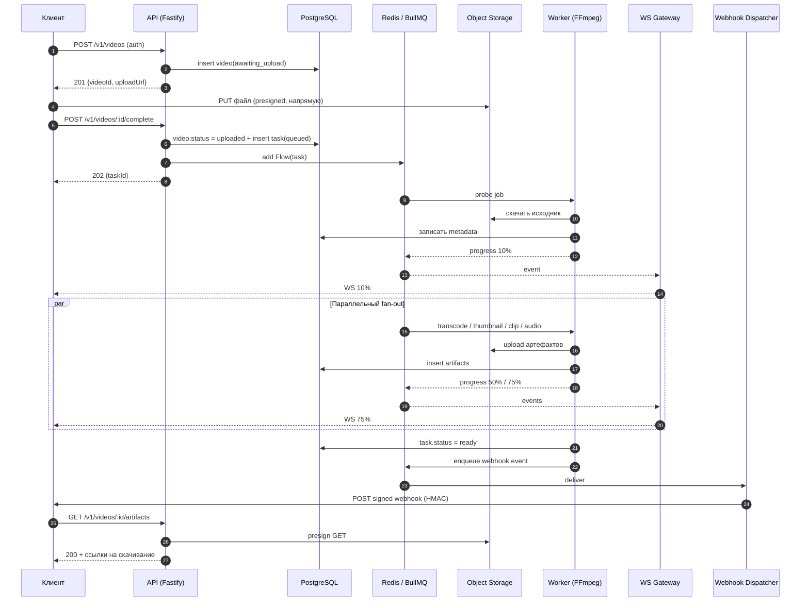
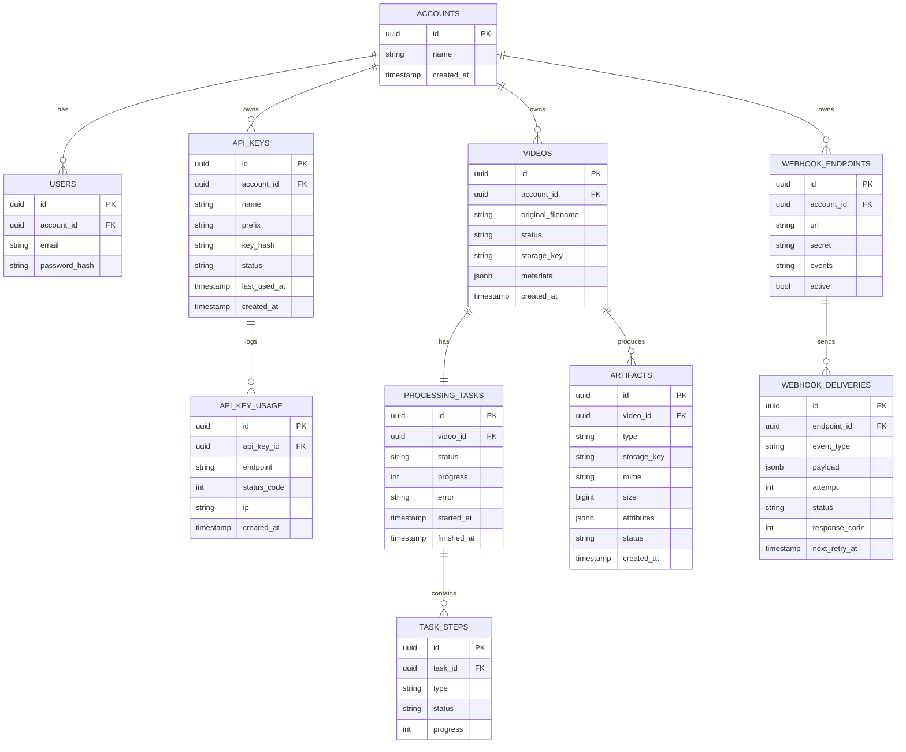
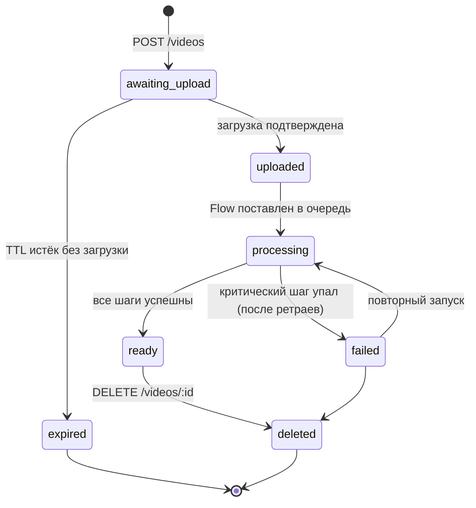
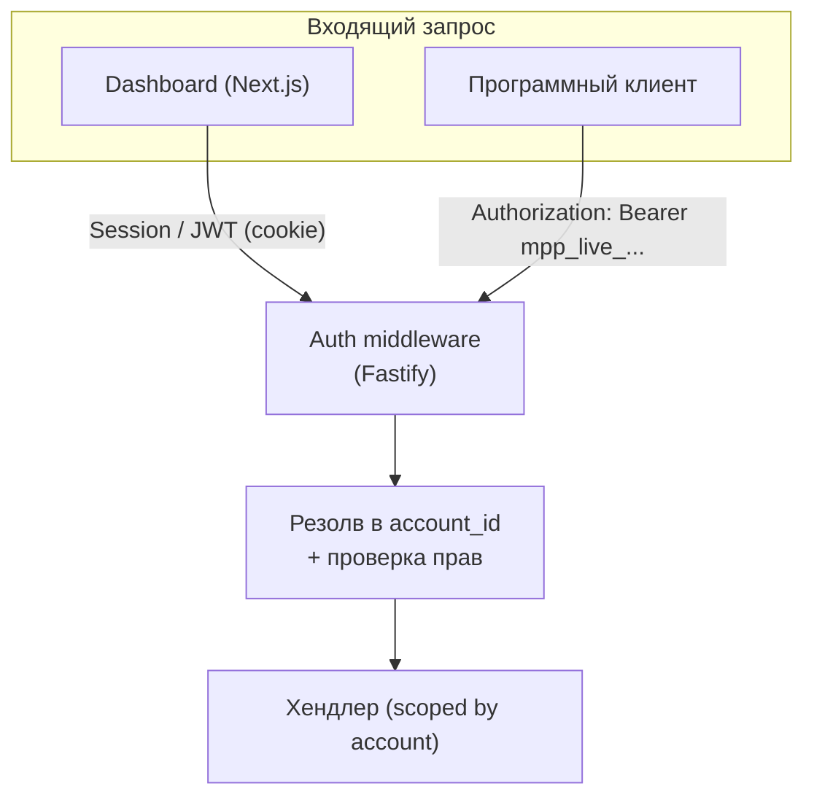
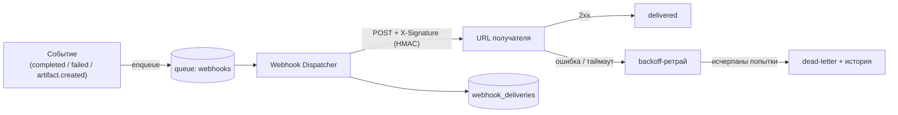
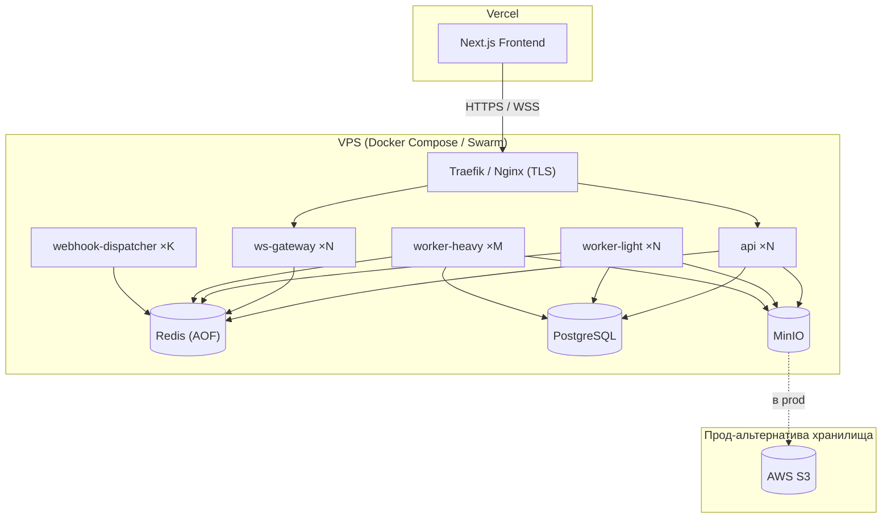

# Архитектура: Media Processing Platform

> Документ описывает целевую архитектуру системы из [`functional_requirements.md`](./functional_requirements.md).
> Диаграммы даны в двух форматах: ASCII (читается в любом просмотрщике/терминале) и
> [Mermaid](https://mermaid.js.org/) (рендерится на GitHub/GitLab и в большинстве IDE).

**Версия:** 1.0 · **Статус:** проект (design) · **Связанный документ:** ТЗ v1.0

---

## Содержание

1. [Архитектурные принципы](#1-архитектурные-принципы)
2. [Обзорная блок-схема](#2-обзорная-блок-схема)
3. [Компоненты системы](#3-компоненты-системы)
4. [Конвейер обработки (DAG)](#4-конвейер-обработки-dag)
5. [Очереди и декомпозиция задач](#5-очереди-и-декомпозиция-задач)
6. [Реальное время: прогресс и WebSocket](#6-реальное-время-прогресс-и-websocket)
7. [Сквозной сценарий (sequence)](#7-сквозной-сценарий-sequence)
8. [Модель данных](#8-модель-данных)
9. [Жизненный цикл видео и задачи](#9-жизненный-цикл-видео-и-задачи)
10. [Загрузка файлов](#10-загрузка-файлов)
11. [Хранилище и раскладка артефактов](#11-хранилище-и-раскладка-артефактов)
12. [Аутентификация и авторизация](#12-аутентификация-и-авторизация)
13. [Публичный API](#13-публичный-api)
14. [Webhooks](#14-webhooks)
15. [Ограничение запросов (rate limiting)](#15-ограничение-запросов-rate-limiting)
16. [Отказоустойчивость и надёжность](#16-отказоустойчивость-и-надёжность)
17. [Наблюдаемость](#17-наблюдаемость)
18. [Безопасность](#18-безопасность)
19. [Развёртывание](#19-развёртывание)
20. [Масштабирование](#20-масштабирование)
21. [Структура репозитория](#21-структура-репозитория)
22. [Соответствие ТЗ (traceability)](#22-соответствие-тз-traceability)
23. [Открытые вопросы и дальнейшие шаги](#23-открытые-вопросы-и-дальнейшие-шаги)

---

## 1. Архитектурные принципы

Архитектура подчинена пяти свойствам, прямо требуемым ТЗ (разделы 6, 15):

| Принцип | Что означает на практике |
|---|---|
| **API-first** | Любая функция доступна через REST до того, как появляется UI. Web — лишь клиент того же API. OpenAPI-схема — источник правды для документации и Sandbox. |
| **Асинхронность** | HTTP-запрос никогда не ждёт FFmpeg. Запрос только создаёт задачу и ставит её в очередь; обработка идёт в фоне. |
| **Stateless-сервисы** | API- и WS-инстансы не хранят состояния в памяти. Всё состояние — в PostgreSQL (факты) и Redis (очередь/события/кэш). Любой инстанс заменяем → горизонтальное масштабирование и отказоустойчивость. |
| **Разделение нагрузки** | «Лёгкие» (API, probe, thumbnail) и «тяжёлые» (transcode, HLS) операции изолированы по процессам/очередям и масштабируются независимо. |
| **Multi-tenant изоляция** | Каждая сущность принадлежит `account`. Каждый запрос и каждый ключ хранилища изолированы по `account_id`. Арендатор не видит чужих данных. |

Дополнительно: **идемпотентность** задач (любая может быть переисполнена после сбоя), **versioned API** (`/v1`), **infrastructure-as-code** (Docker + Compose + CI/CD).

---

## 2. Обзорная блок-схема

Верхнеуровневое представление всех компонентов и связей.

```
                            ┌──────────────────────────────┐
        Браузер ───HTTPS──▶ │   Next.js Frontend (Vercel)  │
                            └──────────────┬───────────────┘
                                           │ REST / WSS
        Внешние                            ▼
        приложения ─HTTPS─▶ ┌──────────────────────────────┐
        (API-клиенты)       │   Reverse Proxy (TLS, LB)    │
                            └───────┬──────────────┬───────┘
                                    ▼              ▼
                         ┌────────────────┐ ┌──────────────┐
                         │  API Gateway   │ │  WS Gateway  │
                         │  Fastify ×N    │ │  (real-time) │
                         └───┬───────┬────┘ └──────┬───────┘
              enqueue jobs   │       │ read/write  │ subscribe (pub/sub)
                             ▼       ▼             ▼
                      ┌──────────┐ ┌──────────┐ ┌──────────────────────────┐
                      │  Redis   │ │PostgreSQL│ │  Redis Pub/Sub (события) │
                      │ BullMQ   │ │  (OLTP)  │ └──────────────────────────┘
                      └────┬─────┘ └────▲─────┘            ▲
                      jobs │            │ metadata/status  │ progress
                           ▼            │                  │
                  ┌─────────────────────┴──────────────────┴───┐
                  │            Worker Pool (FFmpeg) ×N          │
                  │  probe · transcode · hls · thumb · audio   │
                  └───────────────────────┬────────────────────┘
                                          │ put / get
                                          ▼
                            ┌──────────────────────────────┐
                            │  Object Storage (MinIO / S3) │
                            └──────────────────────────────┘

  Webhooks: Worker ─emit─▶ Redis ─▶ Webhook Dispatcher ─signed POST─▶ внешний URL
```

Тот же контур в Mermaid:



---

## 3. Компоненты системы

| Компонент | Технологии | Ответственность | Состояние |
|---|---|---|---|
| **Frontend** | Next.js, TanStack Query, Zustand | Dashboard, загрузка, прогресс, документация, API Sandbox | Stateless (на Vercel) |
| **Reverse Proxy / LB** | Nginx / Traefik / Caddy | TLS-терминация, балансировка, маршрутизация HTTP+WS | Stateless |
| **API Gateway** | Fastify, Zod, Pino | REST-эндпоинты, валидация, авторизация, постановка задач, presigned URLs, rate limit | Stateless (×N) |
| **WS Gateway** | `@fastify/websocket` | Реал-тайм прогресс/события клиентам; подписка на Redis Pub/Sub | Stateless (×N) |
| **Queue** | Redis + BullMQ | Очереди задач, ретраи, backoff, обнаружение зависших, DLQ | Персистентное (Redis AOF) |
| **Worker Pool** | Node.js, BullMQ Worker, FFmpeg/ffprobe | Реальная обработка медиа, генерация артефактов, прогресс | Stateless + локальный scratch-диск |
| **Webhook Dispatcher** | BullMQ Worker | Доставка исходящих уведомлений, ретраи, HMAC-подпись, история | Stateless |
| **PostgreSQL** | PostgreSQL + Drizzle ORM | Источник правды: accounts, videos, tasks, artifacts, keys, webhooks | Персистентное |
| **Object Storage** | MinIO (dev) / S3 (prod) | Бинарные данные: оригиналы + артефакты | Персистентное |

**Почему так, а не монолит.** API, воркеры и WS живут как отдельные процессы, потому что у них принципиально разные профили нагрузки и масштабирования: API — много коротких запросов (масштаб по RPS), воркеры — длинные CPU-bound FFmpeg-задачи (масштаб по глубине очереди и ядрам), WS — много долгоживущих соединений (масштаб по числу коннектов). Объединение их в один процесс заставило бы масштабировать всё вместе и сделало бы тяжёлый transcode причиной деградации API.

---

## 4. Конвейер обработки (DAG)

Обработка одного видео — это **направленный ациклический граф** подзадач, а не один монолитный job. Это даёт параллелизм, независимые ретраи каждого артефакта и точечное масштабирование.



**Логика этапов:**

- **`probe` — gate (выполняется первым).** `ffprobe` извлекает метаданные (длительность, разрешение, FPS, кодеки, битрейт, соотношение сторон). Это не просто артефакт: от результата зависят параметры следующих этапов. Например, если исходник 480p — рендиции 720p/1080p **не создаются** (апскейл не нужен), лестница HLS урезается. Поэтому `probe` гейтит остальные шаги.
- **Fan-out (параллельно).** После `probe` веер независимых задач: миниатюры, клип, аудио, рендиции. Каждая — отдельный job, может уехать на любой свободный воркер, ретраится независимо.
- **`HLS` — fan-in по рендициям.** Адаптивный стриминг собирается из готовых рендиций, поэтому пакетирование ждёт `transcode_*`.
- **`finalize` — корень.** Ждёт завершения всех ветвей, переводит задачу в `ready`, эмитит событие `processing.completed` в очередь webhook'ов.

**Реализация на BullMQ.** BullMQ Flows исполняют дерево «листья → корень» (родитель ждёт детей). Это идеально для fan-in (`finalize` ← все, `hls` ← рендиции), но не для гейта `probe` (он должен идти *первым*, а не последним). Поэтому конвейер двухфазный:

1. **Фаза A:** одиночный job `probe`. По успеху он сохраняет метаданные и, **зная разрешение исходника**, динамически конструирует Flow фазы B.
2. **Фаза B:** BullMQ Flow с деревом `finalize ⟵ { thumbnail, clip, audio, hls ⟵ { rendition_* } }`. Листья исполняются параллельно по всему пулу воркеров.

Такое разделение бонусом решает «не апскейлить»: набор рендиций вычисляется уже после `probe`.

---

## 5. Очереди и декомпозиция задач

Задачи разнесены по очередям **по классу нагрузки** — у каждой свои concurrency, таймауты, приоритет и (главное) свой деплоймент воркеров.



| Очередь | Тип задач | Concurrency на воркер | Особенности |
|---|---|---|---|
| `probe` | ffprobe-метаданные | высокая (IO-bound) | гейт; быстро; маленький таймаут |
| `media-light` | thumbnail, frames, clip, audio | средняя | умеренный CPU |
| `media-heavy` | transcode 360/480/720/1080, HLS | низкая (≈ ядра ÷ threads) | большой таймаут; отдельный деплой; приоритет по разрешению |
| `webhooks` | доставка уведомлений | высокая | экспоненциальный backoff; DLQ |

> Очереди можно схлопнуть до двух (`light` / `heavy`) на старте MVP — модель «очередь на класс нагрузки» сохраняется, меняется лишь гранулярность.

**Параметры job по умолчанию (BullMQ):** `attempts: 3`, `backoff: { type: 'exponential', delay: 5000 }`, `removeOnComplete: { age: 24h }`, `removeOnFail: false` (для разбора), плюс `stalledInterval` для обнаружения упавших воркеров.

---

## 6. Реальное время: прогресс и WebSocket

**Проблема:** воркеры (одни процессы) считают прогресс, а WS-соединение клиента висит на другом, случайном API-инстансе. Память шарить нельзя.

**Решение:** Redis Pub/Sub как шина событий. Воркер публикует прогресс в канал; **все** WS-инстансы подписаны и пушат событие тем клиентам, что подписаны на эту задачу. Sticky-сессии не нужны.



**Поток прогресса по шагам:**

1. FFmpeg пишет прогресс в pipe (`-progress`), воркер парсит `out_time`/`frame` → `0..100%` для шага.
2. Воркер публикует `{ taskId, step, stepProgress, status }` в Redis.
3. **Агрегатор** считает общий процент задачи как взвешенную сумму шагов (вес ∝ ожидаемой стоимости: 1080p тяжелее миниатюры) и сохраняет снапшот в `processing_tasks.progress`.
4. WS-инстансы рассылают событие подписчикам задачи.

**Типы событий WS** (ТЗ §7): `task.started`, `task.progress` (0/25/50/75/100%), `task.completed`, `task.failed`, `artifact.created`.

**Надёжность доставки.** WS — best-effort. Истинное состояние всегда персистится в Postgres, поэтому:
- переподключившийся клиент получает актуальный статус через `GET /v1/tasks/:id`;
- доступен фоллбэк-поллинг, если WS недоступен (корпоративные прокси).

**Аутентификация WS:** короткоживущий токен (`?token=...`, выданный API). Клиент может подписаться только на задачи своего `account`.

---

## 7. Сквозной сценарий (sequence)

Полный путь: загрузка → обработка → уведомление → скачивание (объединяет сценарии №1 и №2 из ТЗ).



---

## 8. Модель данных

PostgreSQL — единый источник правды. Схема и миграции — через Drizzle ORM.



**Ключевые заметки по таблицам:**

- **`videos.metadata`** (jsonb): `duration`, `width`, `height`, `fps`, `video_codec`, `audio_codec`, `bitrate`, `aspect_ratio`, `size` — гибкая полу-структура из `ffprobe`.
- **`processing_tasks`** — это «задача» в терминах пользователя (ТЗ §6); одна задача ↔ один BullMQ Flow. `progress` — агрегат по `task_steps`.
- **`task_steps`** — гранулярный статус подзадач (probe, transcode_720, hls…). Питает детальный экран дашборда и точный расчёт общего процента.
- **`artifacts.type`** — enum: `thumbnail`, `frames`, `clip`, `rendition`, `hls`, `audio`. `attributes` хранит специфику (например, `{ resolution: "720p", bitrate: 2500 }`).
- **`api_keys.key_hash`** — хранится только хэш ключа (никогда сам ключ). `prefix` (например, `mpp_live_AbCd`) показывается пользователю для идентификации.
- **`api_key_usage`** — высокочастотная таблица (ТЗ §10 «история использования»). Кандидат на партиционирование по времени и периодическую агрегацию.
- Все «owned»-таблицы имеют `account_id` и индексируются по нему — основа multi-tenant изоляции.

---

## 9. Жизненный цикл видео и задачи



`expired` нужен, чтобы чистить «висящие» видео, для которых был выдан presigned URL, но файл так и не загрузили (фоновый GC по TTL).

---

## 10. Загрузка файлов

Видео могут весить гигабайты, поэтому **проксировать их через API недопустимо** (память/диск/время API-инстанса).

**Основной путь — presigned upload:**

```
1. POST /v1/videos      → API создаёт video(awaiting_upload), возвращает presigned PUT URL
2. PUT <presigned>       → клиент льёт файл НАПРЯМУЮ в Object Storage (минуя API)
3. POST /videos/:id/complete → API помечает uploaded и ставит Flow в очередь
```

Преимущества: API не держит большие тела, нагрузка ложится на S3/MinIO (которые для этого и созданы), масштабируется тривиально.

**Fallback для MVP — multipart-стрим через API:** `@fastify/multipart` в режиме стрима пишет тело напрямую в Object Storage, не буферизуя в память. Проще для первого релиза, но упирается в пропускную способность API.

**Валидация:** размер ограничивается до загрузки (presigned policy / лимит multipart). Реальный контейнер и кодеки проверяются на этапе `probe` через `ffprobe` — **не доверяем расширению и Content-Type**. Разрешённые контейнеры: MP4, MOV, MKV, WEBM, AVI (ТЗ §5.1).

---

## 11. Хранилище и раскладка артефактов

Ключи в Object Storage неймспейснуты по арендатору и видео:

```
{accountId}/{videoId}/original/source.<ext>
{accountId}/{videoId}/thumbnails/thumb_0001.jpg
{accountId}/{videoId}/frames/frame_0001.jpg ...
{accountId}/{videoId}/clip/clip.mp4
{accountId}/{videoId}/renditions/360p.mp4
{accountId}/{videoId}/renditions/720p.mp4
{accountId}/{videoId}/hls/playlist.m3u8
{accountId}/{videoId}/hls/segment_000.ts ...
{accountId}/{videoId}/audio/audio.mp3
```

- **Скачивание** — только через **presigned GET** (короткий TTL). API не отдаёт байты сам.
- **Изоляция** — префикс `accountId` + bucket-политики не дают пересечь арендаторов.
- **Удаление** (`DELETE /videos/:id`) рекурсивно сносит весь префикс `{accountId}/{videoId}/` и каскадно — строки в БД.
- **dev/prod-паритет:** один и тот же S3-совместимый клиент; различается только endpoint (MinIO ↔ S3).

---

## 12. Аутентификация и авторизация

Два независимых контекста аутентификации, оба отображаются в один `account`:



| Контекст | Метод | Хранение |
|---|---|---|
| **Пользователи дашборда** | email+пароль → session/JWT-cookie | `password_hash` (argon2/bcrypt) |
| **API-клиенты** | API-ключ в `Authorization: Bearer` | только `key_hash` (SHA-256) + `prefix` |

**Проверка API-ключа:** хэшируем входящий ключ → ищем по `key_hash` → проверяем `status = active` → резолвим `account_id`. Результат кэшируется в Redis (короткий TTL), чтобы не бить в Postgres на каждый запрос. Параллельно пишется `api_key_usage` (асинхронно, не на критическом пути) и обновляется `last_used_at`.

**Авторизация:** все запросы к данным жёстко scoped по `account_id` из контекста — арендатор не может обратиться к чужому `videoId`, даже зная его.

---

## 13. Публичный API

REST, версионирование через префикс `/v1`. Схема описывается через `@fastify/swagger` (OpenAPI) — она же питает раздел документации и Sandbox.

| Метод | Путь | Назначение |
|---|---|---|
| `POST` | `/v1/videos` | Создать видео + получить upload URL |
| `POST` | `/v1/videos/:id/complete` | Подтвердить загрузку, запустить обработку |
| `GET` | `/v1/videos` | Список видео (пагинация, фильтры) |
| `GET` | `/v1/videos/:id` | Детали + метаданные + статус |
| `GET` | `/v1/videos/:id/artifacts` | Список артефактов + ссылки на скачивание |
| `DELETE` | `/v1/videos/:id` | Удалить видео и все артефакты |
| `GET` | `/v1/tasks/:id` | Статус и прогресс задачи (фоллбэк к WS) |
| `GET/POST/PATCH/DELETE` | `/v1/webhooks[/:id]` | Управление webhook-эндпоинтами |
| `GET/POST` | `/v1/api-keys` | Список / создание ключей |
| `POST` | `/v1/api-keys/:id/disable` | Отключить ключ |
| `DELETE` | `/v1/api-keys/:id` | Удалить ключ |
| `WS` | `/v1/ws?token=...` | Подписка на реал-тайм события задач |

**Сквозные свойства:** валидация входа/выхода через Zod; единый формат ошибок (`{ error: { code, message, details } }`) — питает раздел «Ошибки» в документации (ТЗ §13); корреляционный `request_id` в каждом ответе и логе.

**Документация и Sandbox (ТЗ §13–14)** — генерируются из OpenAPI-схемы: Swagger UI / Scalar в роли интерактивной песочницы (отправка запросов, загрузка файлов, просмотр ответов, примеры).

---

## 14. Webhooks

Исходящие уведомления вынесены в **отдельную очередь и сервис**, чтобы медленный или упавший получатель никогда не блокировал обработку медиа.



- **События** (ТЗ §9): `processing.completed`, `processing.failed`, `artifact.created`.
- **Подпись:** тело подписывается HMAC по `secret` эндпоинта → заголовок `X-Signature`; получатель проверяет подлинность.
- **Надёжность:** экспоненциальный backoff, ограниченное число попыток, dead-letter; идемпотентный `event_id` (получатель дедуплицирует повторы).
- **История:** каждая попытка пишется в `webhook_deliveries` (статус, код ответа, время) → видно в дашборде.
- **Развязка:** одно событие → несколько эндпоинтов; доставка каждому независима.

---

## 15. Ограничение запросов (rate limiting)

`@fastify/rate-limit` со **store в Redis** — лимит общий для всех API-инстансов.

- **Ключ лимита:** `api_key_id` (а не IP).
- **Порог:** 100 req/min на ключ (ТЗ §11), конфигурируемо per-key (под будущие тарифы).
- **Ответ при превышении:** `429 Too Many Requests` + заголовки `Retry-After`, `X-RateLimit-Limit`, `X-RateLimit-Remaining`, `X-RateLimit-Reset`.
- **Алгоритм:** sliding-window / token-bucket в Redis (атомарно, без гонок между инстансами).

---

## 16. Отказоустойчивость и надёжность

ТЗ §15 требует «отказоустойчивость очередей». Меры по слоям:

| Риск | Защита |
|---|---|
| Падение воркера на середине job | BullMQ stalled-detection → job возвращается в очередь и переисполняется |
| Транзиентная ошибка (сеть, FFmpeg) | `attempts` + экспоненциальный backoff |
| Повторное исполнение портит данные | Идемпотентность: детерминированные ключи хранилища, шаг помечается done транзакционно в БД |
| Перезапуск Redis | Персистентность AOF (`everysec`); в prod — Sentinel/replica |
| «Висящие» видео без загрузки | Фоновый GC по TTL (`awaiting_upload` → `expired`) |
| Зависший FFmpeg | Таймаут на job + kill процесса |
| Бесконечные ретраи | Лимит попыток → dead-letter + событие `processing.failed` |
| Деплой/рестарт | Graceful shutdown (SIGTERM): воркер дорабатывает или корректно отпускает текущий job |
| Перегрузка очереди | Метрика глубины очереди → автоскейл воркеров (см. §20) |

Итог: потеря любого одного воркера/API-инстанса **не теряет задачи** и **не теряет данные** — состояние в Postgres, очередь в Redis, файлы в Object Storage.

---

## 17. Наблюдаемость

| Аспект | Решение |
|---|---|
| **Логирование** (ТЗ §15) | Pino — структурные JSON-логи. Корреляционный `request_id` / `task_id` сквозит API → очередь → воркер. Централизация (Loki/ELK) — позже. |
| **Метрики** | Глубина очередей, длительности job, success/fail rate, время FFmpeg, latency API, rate-limit hits. Prometheus + Grafana (этап 2). |
| **Инспекция очередей** | Bull Board — UI для просмотра/ретрая job. |
| **Health-checks** | `/health` (liveness) и `/ready` (readiness: доступны ли Postgres, Redis, Storage) — для оркестратора и LB. |
| **Трейсинг** | OpenTelemetry (опционально, этап 2). |

---

## 18. Безопасность

- **Секреты ключей** хранятся только хэшем; сам ключ показывается один раз при создании.
- **Webhook-подпись** HMAC — защита от подделки уведомлений.
- **Presigned URLs** — короткий TTL, узкая область действия.
- **Валидация входа** — Zod на границе API; реальные кодеки/контейнер проверяются `ffprobe`.
- **Защита FFmpeg** — аргументы передаются массивом (никакой shell-интерполяции имён файлов → нет инъекций); ресурсные лимиты и таймауты; обработка в изолированном контейнере.
- **Tenant-изоляция** — `account_id` в каждом запросе и в каждом ключе хранилища.
- **TLS** везде (LB терминирует HTTPS/WSS).
- **Секреты окружения** — через env / secret manager, не в коде.

---

## 19. Развёртывание



**Сервисы `docker-compose` (dev):** `web`, `api`, `ws`, `worker-light`, `worker-heavy`, `webhook-dispatcher`, `postgres`, `redis`, `minio`, `proxy`. Один `docker compose up` поднимает всю платформу локально.

**Окружения:**
- **dev** — Docker Compose, MinIO как S3.
- **prod** — Frontend на Vercel; Backend на VPS (Compose/Swarm); хранилище — S3.

**CI/CD (GitHub Actions):** lint → typecheck → тесты → сборка образов → push в registry → деплой (backend → VPS, frontend → Vercel). Миграции Drizzle прогоняются отдельным шагом перед стартом API.

---

## 20. Масштабирование

| Слой | Ось масштабирования | Как |
|---|---|---|
| **API** | RPS | + инстансы за LB (stateless) |
| **WS Gateway** | число соединений | + инстансы (фан-аут через Redis Pub/Sub, sticky не нужен) |
| **Worker-heavy** | глубина очереди transcode | + реплики; автоскейл по метрике `queue depth` |
| **Worker-light** | глубина лёгких очередей | + реплики независимо |
| **PostgreSQL** | чтение | read-replica (этап 2); сейчас вертикально |
| **Redis** | надёжность/throughput | Sentinel / Cluster (этап 2) |
| **Object Storage** | объём | S3 эластичен по определению |

Ключевое свойство: **тяжёлый transcode масштабируется отдельно от всего остального** — всплеск загрузок не роняет API и не тормозит лёгкие артефакты.

---

## 21. Структура репозитория

Рекомендуется **monorepo** (pnpm workspaces / Turborepo): API, воркеры и web делят типы, Zod-схемы и контракты job — единый источник правды, единый CI.

```
asset-processing-service/
├── apps/
│   ├── web/                 # Next.js (Dashboard, Docs, Sandbox)
│   ├── api/                 # Fastify (REST + WS Gateway)
│   ├── worker/              # BullMQ воркеры + FFmpeg-пайплайн
│   └── webhook-dispatcher/  # доставка webhook'ов
├── packages/
│   ├── db/                  # Drizzle: схема + миграции
│   ├── core/                # доменные типы, Zod-схемы, бизнес-логика
│   ├── queue/               # определения очередей и контракты job
│   ├── storage/             # S3/MinIO-клиент (presign, put, get, delete)
│   └── config/              # env-валидация, общий конфиг
├── infra/
│   ├── docker-compose.yml
│   └── docker/              # Dockerfile на сервис
├── .github/workflows/       # CI/CD
└── architecture/
    ├── functional_requirements.md
    └── architecture_schema.md   # (этот документ)
```

Почему monorepo: контракт «job → артефакт» и формы API используются и API, и воркером, и фронтом. Общий пакет `core` гарантирует, что они не разойдутся; альтернатива (отдельные репозитории) потребовала бы публикации пакетов и синхронизации версий.

---

## 22. Соответствие ТЗ (traceability)

Каждое требование ТЗ закрыто конкретным компонентом архитектуры.

| Требование ТЗ | Реализующий компонент |
|---|---|
| §5.1 Загрузка видео | API + presigned upload + Object Storage (§10–11) |
| §5.2 Метаданные | `probe`-воркер (ffprobe) → `videos.metadata` (§4, §8) |
| §5.3 Превью/кадры | `thumbnail`-воркер → артефакты `thumbnail`/`frames` |
| §5.4 Короткий клип | `clip`-воркер (по умолч. 10с) |
| §5.5 Транскодирование | `transcode`-воркеры 360/480/720/1080 (heavy-очередь) |
| §5.6 HLS | `hls`-воркер (fan-in по рендициям) |
| §5.7 Извлечение аудио | `audio`-воркер (mp3/aac/wav/ogg) |
| §6 Асинхронные задачи | BullMQ Flows + `processing_tasks` (§4–5) |
| §7 Реал-тайм статус | WS Gateway + Redis Pub/Sub (§6) |
| §8 Публичный API | Fastify REST `/v1` + OpenAPI (§13) |
| §9 Webhooks | Webhook Dispatcher + HMAC + история (§14) |
| §10 API-ключи | `api_keys` + `api_key_usage` (§8, §12) |
| §11 Rate limiting | `@fastify/rate-limit` на Redis (§15) |
| §12 Личный кабинет | Next.js Dashboard (§3, §21) |
| §13 Документация API | OpenAPI → Swagger/Scalar (§13) |
| §14 API Sandbox | Интерактивный UI поверх OpenAPI (§13) |
| §15 Нефункциональные | §16 (отказоустойчивость), §17 (логи), §19 (Docker/CI), §20 (масштаб) |
| §16 Стек | Соблюдён в §3 и §21 |
| §17 Критерии MVP | Покрыты сквозным сценарием §7 |

---

## 23. Открытые вопросы и дальнейшие шаги

Решения, которые стоит подтвердить с продуктовой стороны (не блокируют старт, но влияют на детали):

1. **`account` vs `user`** — нужна ли многопользовательская команда внутри аккаунта в MVP, или 1 пользователь = 1 аккаунт? (влияет на модель прав)
2. **Upload-стратегия для MVP** — сразу presigned или начать с multipart-стрима? (presigned масштабируемее, multipart быстрее в разработке)
3. **Квоты и тарифы** — кроме rate limit, нужны ли лимиты на объём хранилища / минуты обработки?
4. **Хранение исходника** — удалять оригинал после успешной обработки или хранить (для пере-обработки)? (влияет на стоимость хранилища)
5. **Гранулярность очередей** — стартовать с 2 очередей (`light`/`heavy`) или сразу с 4? (рекомендация: 2 → расширять по нагрузке)
6. **Retention артефактов** — есть ли TTL у результатов, или хранятся бессрочно?

**Предлагаемый порядок реализации (этапы):**

1. **Каркас:** monorepo, `packages/db` (схема Drizzle), `docker-compose` (postgres/redis/minio), health-checks.
2. **Ядро обработки:** API загрузки → очередь → `probe` + `transcode` → артефакты в Storage (вертикальный срез сценария MVP §17).
3. **Реал-тайм:** WS Gateway + агрегатор прогресса.
4. **Остальные артефакты:** thumbnail, clip, audio, HLS.
5. **Платформа:** API-ключи, rate limit, webhooks.
6. **Frontend:** Dashboard, Docs, Sandbox.
7. **Прод-хардненинг:** CI/CD, метрики, автоскейл воркеров.
```
